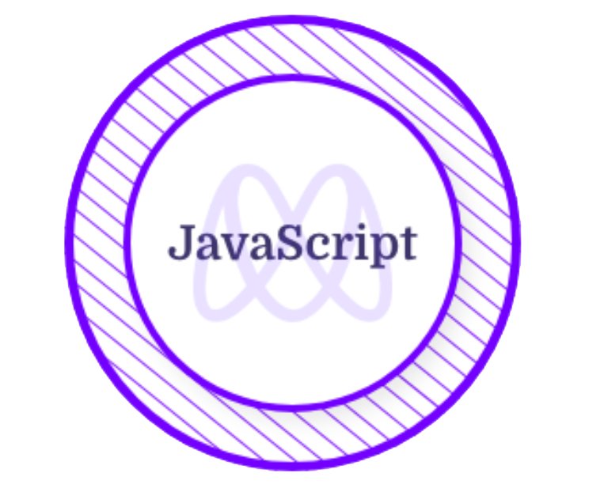
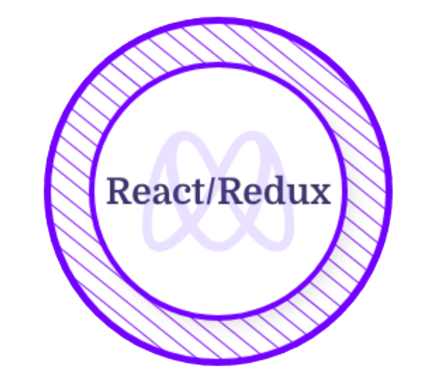

<!-- Updating my readme for GitHub-->

<h1 align="center">Hi , I'm Taheny BELGUITH!</h1>

<!-- Typing SVG by DenverCoder1 - https://github.com/DenverCoder1/readme-typing-svg -->

<!--   <a href="https://github.com/DenverCoder1/readme-typing-svg"> -->
    </a>

<!-- Social icons section -->

&#8287;&#8287;&#8287;

&#8287;&#8287;&#8287;
 
&#8287;&#8287;&#8287;

&#8287;&#8287;&#8287;

 
 

### About Me 🚀  

- 🎓 I freshly get my Master's degree in Computer Science & Software Engineering at the Higher Institute of Computer Science and Mathematics of Monastir.  
- 👩‍ Currently, I am studying at [Microverse](https://www.microverse.org/), an online training school where I code 8 hours a day remotely with other developers and have learned the skills of communication and teamwork.  
- 💻 All **my projects** are available [here.](https://github.com/TahenyBELGUITH?tab=repositories).  

---

### :hammer_and_wrench: Languages and Tools :

  &nbsp;
  &nbsp;
  &nbsp;
  &nbsp;
  &nbsp;
  &nbsp;
  &nbsp;
    &nbsp;
    &nbsp;
    &nbsp;
   &nbsp;
    &nbsp;
    &nbsp;
  
  &nbsp;

---

### Certificates & Licenses 🥇

  &nbsp; &nbsp; &nbsp; &nbsp;    

---

&nbsp;
 
| Statistics |   Languages |
| ---------- | ----------- |
 |  | |

 

---

### This week I spent my time on  

---

### Github activity 🚀

<!-- https://github.com/ashutosh00710/github-readme-activity-graph -->

---

 <em><b>I love connecting with different people</b> so if you want to say <b>hi, I'll be happy to meet you more!</b> 😊 </em>

---
⭐️ From [@ha-manel](https://github.com/ha-manel)
